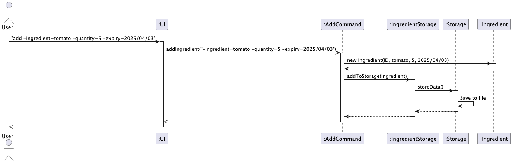
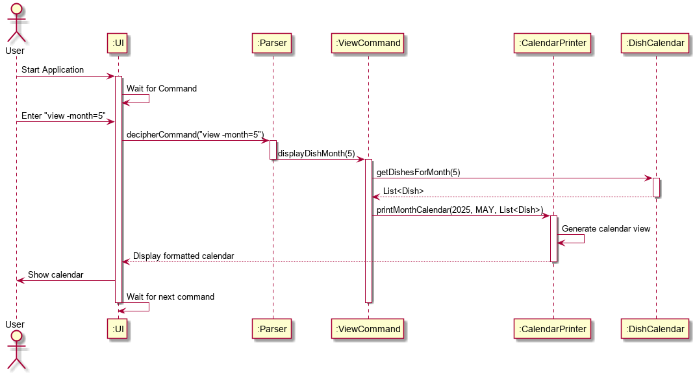
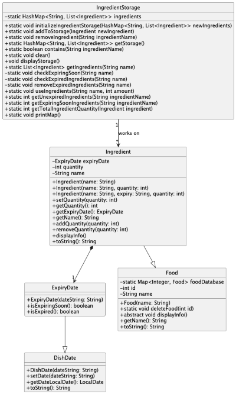
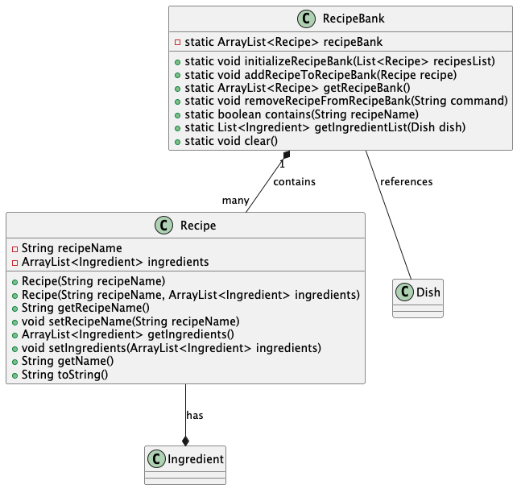
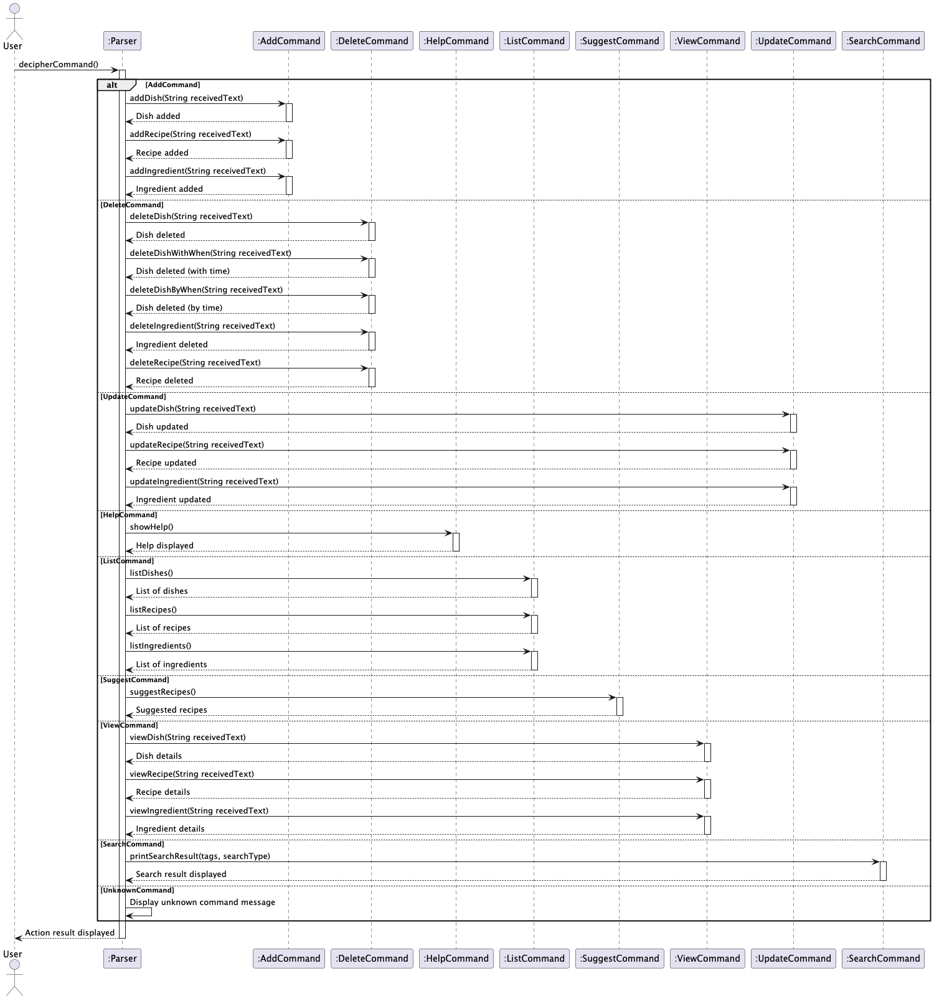
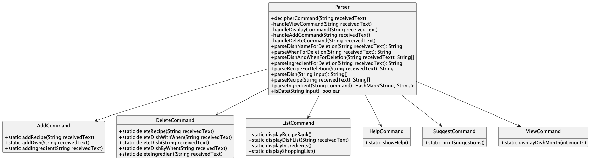

# Developer Guide

## Acknowledgements

{list here sources of all reused/adapted ideas, code, documentation, and third-party libraries -- 
include links to the original source as well}

## Design & implementation

Given below is a quick overview of main components and how they interact with each other.

### Main components of the architecture
The class `CookingAids` is in charge of the app launch and shut down.
* At it initializes the other components in the correct sequence, and connects them up with each other.
* At shut down, it shuts down the other components and invokes cleanup methods where necessary.

The bulk of the app's work is done by the following components:
* `UI`: The UI of the App.
* `Command`:The command executor.
* `Collections`: Operates on data of the App in memory.
* `Storage`: Reads data from, and writes data to, the hard disk.
* `Items`: Represents a collection of classes used by other components.

### How the architecture components interact with each other
The _Sequence Diagram_ below shows how the components interact with each other for the scenario where the user issues 
the command add -ingredient=tomato -quantity=5 -expiry=2025-04-03

### UI 

#### <ins>Overview</ins>

The UI package contains classes responsible for handling user interactions, displaying output, and printing formatted views for various components.

#### <ins>Implementation</ins>

Contains the following classes and their respective purposes:
* `Ui` manages the user interface, handles command input, and displays information to the user.
* `CalendarPrinter` prints a formatted monthly calendar view, displaying scheduled dishes.

These classes facilitate user interaction by providing formatted output and handling command-based operations.

Below is a Sequence Diagram of an example of how a User performs command view -month=5 to view his dishes for the month of May

The class diagrams of UI and Calendar printer are seen below

#### <ins>Design Considerations</ins>

We designed the UI package to provide clear and structured user interactions. Separating UI functions from logic ensures modularity, making it easier to maintain and update. The `Ui` class handles receiving commands and user interaction, while `CalendarPrinter` focuses on structured visual representation of scheduled dishes.

This approach keeps business logic separate from UI logic, improving code maintainability and readability.

### Collections

#### <ins>Overview</ins>

The Collections component contains classes that perform operations requested by the User on their respective Items

#### <ins>Implementation</ins>

Contains the classes and their respective purposes:
* `DishCalendar` manages dishes assigned to a respective date
* `RecipeBank` manages list of recipes learnt
* `IngredientStorage` manages current inventory of ingredients
* `ShoppingList` manages ingredients needed to be purchased

These classes all contain temporary storage to hold the result after the operations.

#### <ins>Design Considerations</ins>

We used this design for easier modularity. There are many different items such as Dishes, Recipes, Ingredients
and they each have their unique purposes and attributes. Hence, we decided to create separate classes that will handle 
operations on items separately and keep a temporary storage of the results of operations, before storing them in a JSON 
file.

The following is a class diagram of one of the classes `IngredientStorage`

### Items

#### <ins>Overview</ins>

The Items component contains classes that represent the smallest unit of functionality for this project.

#### <ins>Implementation</ins>

* `Food` is an abstract class.
* `Ingredient` extends from Food and contains information related to ingredients (name, expiry)
* `Recipe` contains the information of one recipe (name, ingredients)
* `DishDate` represents the date of a `Dish`
* `ExpiryDate` extends from DishDate and represents the expiry date of ingredients
* `Dish` denotes when a `Recipe` is scheduled for a certain `DishDate`

#### <ins>Design Considerations</ins>

The following is the class diagram for the classes Recipe and RecipeBank.

The Items classes follow the above design consideration of modularity. Each class in this package serves as building 
blocks for the rest of the project. 

### Commands

#### <ins>Overview</ins>

The Commands component contains classes that execute specific actions on their respective Collections based on user input. These commands facilitate modifications, retrieval, and processing of data within the system.

#### <ins>Implementation</ins>

Contains the classes and their respective purposes:
* `AddDishCommand` adds a dish to the DishCalendar.
* `RemoveDishCommand` removes a dish from the DishCalendar.
* `AddRecipeCommand` adds a recipe to the RecipeBank.
* `RemoveRecipeCommand` removes a recipe from the RecipeBank.
* `AddIngredientCommand` adds an ingredient to the IngredientStorage.
* `RemoveIngredientCommand` removes an ingredient from the IngredientStorage.
* `AddShoppingItemCommand` adds an item to the ShoppingList.
* `RemoveShoppingItemCommand` removes an item from the ShoppingList.

Each command modifies a specific collection and ensures the necessary updates are performed before storing changes in the system.

#### <ins>Design Considerations</ins>

We used this design to maintain a clear separation of concerns. Commands act as intermediaries between user input and data manipulation, ensuring that modifications to collections are structured and easily extendable. This modular approach allows for easy addition of new commands in the future without interfering with existing functionality.

The following is a UML diagram of the `commands` package:

### Parser

#### <ins>Overview</ins>

The Parser component is responsible for interpreting user input and executing the corresponding commands. It ensures that user instructions are correctly formatted and directs them to the appropriate operations.

#### <ins>Implementation</ins>

The `Parser` class contains methods to process and handle different user commands:
* `decipherCommand(String receivedText)`: Identifies the command type from user input and executes the relevant method.
* `handleViewCommand(String receivedText)`: Handles requests to view data based on user-specified parameters.
* `handleDisplayCommand(String receivedText)`: Manages the display of lists such as recipes, dishes, ingredients, and shopping lists.
* `handleAddCommand(String receivedText)`: Directs the addition of new recipes, dishes, or ingredients to their respective storages.
* `handleDeleteCommand(String receivedText)`: Manages the removal of recipes, dishes, or ingredients based on user input.
* `parseDish(String input)`: Extracts dish details from a given command.
* `parseRecipe(String receivedText)`: Extracts recipe details and its required ingredients.
* `parseIngredient(String command)`: Parses an ingredient command into a structured data format.

The `Parser` class interacts with the following command classes:
* `AddCommand` - Adds recipes, dishes, or ingredients.
* `DeleteCommand` - Removes recipes, dishes, or ingredients.
* `ListCommand` - Displays stored recipes, dishes, ingredients, or shopping lists.
* `HelpCommand` - Shows available user commands.
* `SuggestCommand` - Provides cooking suggestions.
* `ViewCommand` - Displays information based on date or ingredient filters.

#### <ins>Design Considerations</ins>

The design choice of the `Parser` class emphasizes modularity and maintainability. By having separate handler methods for different command types, the system can be easily extended with new commands while keeping parsing logic clear. This approach ensures:

1. **Separation of concerns**: Each command type is processed independently.
2. **Scalability**: New commands can be integrated without affecting existing logic.
3. **Error handling**: Unrecognized commands are identified, preventing incorrect execution.

The following is a class diagram of the `Parser` class and its interactions:

# Appendix: Requirements

## Product scope
### Target user profile

Students who have to cook meals on a tight budget and have limited free time.

### Value proposition

Our app, _COOKING AIDS_ helps students who are studying abroad who have to live on a tight budget plan and prepare 
their meals effectively. The value our app brings to such students are that they no longer have to spend time and effort
planning their meals with their limited budget and time.

## User Stories

| Version | As a ...                          | I can ...                                                       | So that I can ...                                                                  |
|---------|-----------------------------------|-----------------------------------------------------------------|------------------------------------------------------------------------------------|
| v1.0    | Veteran cook                      | add new recipes to the list                                     | enjoy my own recipes without relying on the default list                           |
| v1.0    | forgetful student                 | see my current quantity of ingredients                          | check if I have enough ingredients to make foods and whether I should buy more     |
| v1.0    | indecisive user                   | change my meal plans                                            | have flexibility in my meals                                                       |
| v1.0    | forgetful student                 | see my meal plans for the day                                   | be reminded of what I planned to eat                                               |
| v1.0    | student on exchange               | plan my meals                                                   | efficiently plan out my use of ingredients                                         |
| v1.0    | someone new to cooking            | enter my current ingredients                                    | get suggestions on recipes                                                         |
| v1.0    | user who made a mistake           | delete entries                                                  | customize plan                                                                     |
| v2.0    | inexperienced cook                | see possible recipes that I can create with current ingredients | decide on what food I can create without the effort of referencing online material |
| v2.0    | user                              | see my shopping list                                            | save time and effort of thinking of what to buy for my meal plan                   |
| v2.0    | inexperienced cook                | see the difficulty and time it takes to cook a certain recipe   | know whether I have the time and skills to do some meals                           |
| v2.0    | forgetful student                 | keep track of expiry dates of foods                             | efficiently consume the foods without waste, and so I won't eat expired foods      |
| v2.0    | someone with dietary restrictions | filter recipes based on my restrictions                         | access meals I can eat                                                             |
| v2.0    | nutritionist                      | create healthy recipes for students                             | promote healthier diets amongst unhealthy youths                                   |
| v2.0    | student on a diet                 | home-cook food and be intentional with my ingredients           | maintain a balanced diet                                                           |
| v2.0    | a family member                   | figure out what to cook for the family                          | prepare a good dinner for loved ones                                               |
| v2.0    | student cook with roommates       | share shopping lists with my roommates                          | coordinate buying ingredients                                                      |
| v2.0    | student cook with friends         | calculate cost per meal of each person                          | easily split costs with friends                                                    |
| v2.1    | inexperienced cook                | click on links that direct me to youtube videos                 | refer to videos if I am unable to follow the recipe                                |
| v2.1    | poor student                      | find affordable food shopping locations near me                 | save money                                                                         |
| v2.1    | a busy cook                       | get reminders on expiry dates of ingredients                    | use all my groceries without wasting any                                           |
| v2.1    | beginner meal prepper             | see meal-prepping tips                                          | improve my meal-prepping                                                           |
| v2.1    | health conscious student          | track calories of dishes                                        | know exactly how many calories my food has                                         |
| v2.1    | aspiring chef                     | save my favourite recipes                                       | access them easily                                                                 |
| v2.1    | user that is going to shop soon   | be recommended recipes that are an item away                    | plan what to buy next when I'm not limited by my current ingredients               |
## Non-Functional Requirements

{Give non-functional requirements}

## Glossary

* *glossary item* - Definition

## Instructions for manual testing

{Give instructions on how to do a manual product testing e.g., how to load sample data to be used for testing}
