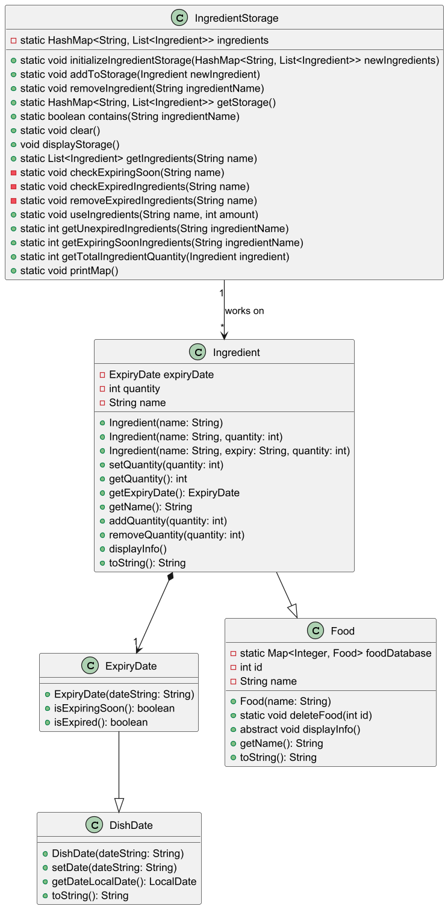

# Developer Guide

## Acknowledgements

{list here sources of all reused/adapted ideas, code, documentation, and third-party libraries -- include links to the original source as well}

## Design & implementation

{Describe the design and implementation of the product. Use UML diagrams and short code snippets where applicable.}

Given below is a quick overview of main components and how they interact with each other.

### Main components of the architecture
`Cooking Aids` is in charge of the app launch and shut down.
* At it initializes the other components in the correct sequence, and connects them up with each other.
* At shut down, it shuts down the other components and invokes cleanup methods where necessary.

The bulk of the app's work is done by the following components:
* `UI`: The UI of the App.
* `Command`:The command executor.
* `Collections`: Operates on data of the App in memory.
* `Storage`: Reads data from, and writes data to, the hard disk.
* `Items`: Represents a collection of classes used by other components.

### How the architecture components interact with each other
The _Sequence Diagram_ below shows how the components interact with each other for the scenario where the user issues 
the command add -ingredient=tomato -quantity=5 -expiry=2025-04-03

### Collections

#### <ins>Overview</ins>

The Collections component contains classes that perform operations requested by the User on their respective Items

#### <ins>Implementation</ins>

Contains the classes and their respective purposes:
* `DishCalendar` manages dishes assigned to a respective date
* `RecipeBank` manages list of recipes learnt
* `IngredientStorage` manages current inventory of ingredients
* `ShoppingList` manages ingredients needed to be purchased

These classes all contain temporary storage to hold the result after the operations.

#### <ins>Design Considerations</ins>

We used this design for easier modularity. There are many different items such as Dishes, Recipes, Ingredients
and they each have their unique purposes and attributes. Hence, we decided to create separate classes that will handle 
operations on items separately and keep a temporary storage of the results of operations, before storing them in a JSON 
file.

The following is a class diagram of one of the classes `IngredientStorage`

# Appendix: Requirements

## Product scope
### Target user profile

* Students busy studying abroad 
* Students on a budget
* Students who want to meal plan

This product is for students who are busy studying overseas, are on budget and may want to plan their meals

### Value proposition

This product helps busy students living overseas on a budget save time and effort when planning and cooking meals.

## User Stories

|Version| As a ... | I want to ... | So that I can ...|
|--------|----------|---------------|------------------|
|v1.0|new user|see usage instructions|refer to them when I forget how to use the application|
|v2.0|user|find a to-do item by name|locate a to-do without having to go through the entire list|

## Non-Functional Requirements

{Give non-functional requirements}

## Glossary

* *glossary item* - Definition

## Instructions for manual testing

{Give instructions on how to do a manual product testing e.g., how to load sample data to be used for testing}
