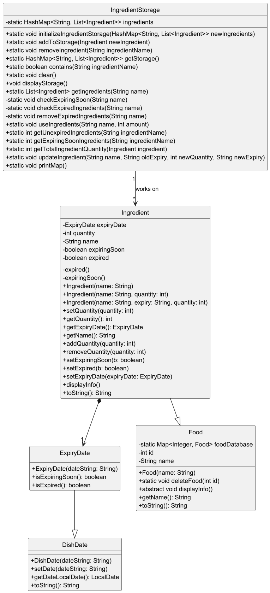

# Developer Guide

## Acknowledgements

{list here sources of all reused/adapted ideas, code, documentation, and third-party libraries -- include links to the original source as well}

## Design & implementation

{Describe the design and implementation of the product. Use UML diagrams and short code snippets where applicable.}

Given below is a quick overview of main components and how they interact with each other.

### Main components of the architecture
`Cooking Aids` is in charge of the app launch and shut down.
* At it initializes the other components in the correct sequence, and connects them up with each other.
* At shut down, it shuts down the other components and invokes cleanup methods where necessary.

The bulk of the app's work is done by the following components:
* `UI`: The UI of the App.
* `Command`:The command executor.
* `Collections`: Operates on data of the App in memory.
* `Storage`: Reads data from, and writes data to, the hard disk.
* `Items`: Represents a collection of classes used by other components.

### How the architecture components interact with each other
The _Sequence Diagram_ below shows how the components interact with each other for the scenario where the user issues 
the command add -ingredient=tomato -quantity=5 -expiry=2025-04-03

## Product scope
### Target user profile

{Describe the target user profile}

### Value proposition

{Describe the value proposition: what problem does it solve?}

## User Stories

| Version | As a ... | I can ... | So that I can ... |
|---------|----------|-----------|-------------------|
| v1.0 | Veteran cook | add new recipes to the list | enjoy my own recipes without relying on the default list |
| v1.0 | forgetful student | see my current quantity of ingredients | check if I have enough ingredients to make foods and whether I should buy more |
| v1.0 | indecisive user | change my meal plans | have flexibility in my meals |
| v1.0 | forgetful student | see my meal plans for the day | be reminded of what I planned to eat |
| v1.0 | student on exchange | plan my meals | efficiently plan out my use of ingredients |
| v1.0 | someone new to cooking | enter my current ingredients | get suggestions on recipes |
| v1.0 | user who made a mistake | delete entries | customize plan |
| v2.0 | inexperienced cook | see possible recipes that I can create with current ingredients | decide on what food I can create without the effort of referencing online material |
| v2.0 | user | see my shopping list | save time and effort of thinking of what to buy for my meal plan |
| v2.0 | inexperienced cook | see the difficulty and time it takes to cook a certain recipe | know whether I have the time and skills to do some meals |
| v2.0 | poor student | enter my current cooking tools | see what dishes I can create with my limited tools |
| v2.0 | forgetful student | keep track of expiry dates of foods | efficiently consume the foods without waste, and so I won't eat expired foods |
| v2.0 | aspiring chef | save my favourite recipes | access them easily |
| v2.0 | someone with dietary restrictions | filter recipes based on my restrictions | access meals I can eat |
| v2.0 | nutritionist | create healthy recipes for students | promote healthier diets amongst unhealthy youths |
| v2.0 | student on a diet | home-cook food and be intentional with my ingredients | maintain a balanced diet |
| v2.0 | a family member | figure out what to cook for the family | prepare a good dinner for loved ones |
| v2.0 | user that is going to shop soon | be recommended recipes that are an item away | plan what to buy next when I'm not limited by my current ingredients |
| v2.0 | student cook with roommates | share shopping lists with my roommates | coordinate buying ingredients |
| v2.0 | student cook with friends | calculate cost per meal of each person | easily split costs with friends |
| v2.1 | inexperienced cook | click on links that direct me to youtube videos | refer to videos if I am unable to follow the recipe |
| v2.1 | poor student | find affordable food shopping locations near me | save money |
| v2.1 | Trendy student | find the most trending recipes/foods | feel up to date |
| v2.1 | a busy cook | get reminders on expiry dates of ingredients | use all my groceries without wasting any |
| v2.1 | beginner meal prepper | see meal-prepping tips | improve my meal-prepping |
| v2.1 | health conscious student | track calories of dishes | know exactly how many calories my food has |

## Non-Functional Requirements

{Give non-functional requirements}

## Glossary

* *glossary item* - Definition

## Instructions for manual testing

{Give instructions on how to do a manual product testing e.g., how to load sample data to be used for testing}
