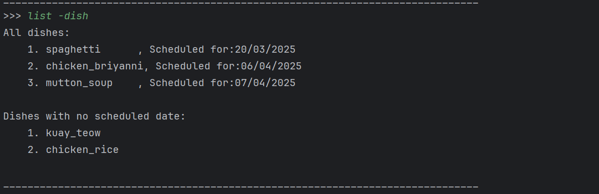
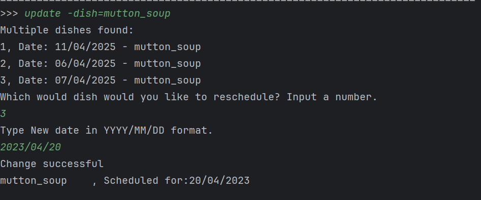
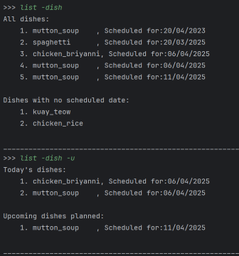

# roycecodes - Project Portfolio Page

## Overview
**Cooking Aids** is a Java program designed to help students who are on exchange plan meals for cooking.  
Taking into account their busy schedules and limited budgets, the program seeks to eliminate ingredient waste and inefficient meal planning.  
The user interacts with the project through a Command Line Interface (CLI), and the application is written in **Java**.

Given below are my contributions to the project.

---

## Summary of Contributions
- [Code Contributed](#code-contributed)
- [Features](#features)
  - [Basic Features](#basic-features)
    - [Dish Dates](#dish-dates-created-dishdate-object-used-by-the-entire-program-for-date-related-functionality)
    - [Dish Calendar](#dish-calendar-central-data-structure-for-planned-meals)
    - [Adding dishes to calendar](#adding-dishes-to-calendar)
    - [Displaying dishes](#displaying-dishes)
    - [Changing scheduled date of dishes](#changing-scheduled-date-of-dishes)
  - [Quality of Life Features](#quality-of-life-features)
    - [Shopping List and Logic](#shopping-list-implementation)
    - [View Command](#view-command)
    - [Calendar Printer](#calendar-printer)
- [Enhancing Existing Features](#enhancements-to-existing-features)
  - [Enhanced Display Dish List with Filters](#enhanced-display-dish-list-with-filters)
- [Documentation](#documentation)
  - [UI and Calendar Printer in DG](#developer-guide)
- [Community](#community-contributions)

---

### **Code Contributed**
🔗 [RepoSense link](https://nus-cs2113-ay2425s2.github.io/tp-dashboard/?search=roycecodes&breakdown=true&sort=groupTitle%20dsc&sortWithin=title&since=2025-02-21&timeframe=commit&mergegroup=&groupSelect=groupByRepos&checkedFileTypes=docs~functional-code~test-code~other)

---

## Features

### Basic Features

#### **Dish Dates**: Created `DishDate` object, used by the entire program for date-related functionality
- **What it does**: Allows users to attach and manipulate dates associated with dishes or ingredients.
- **Justification**: This is a fundamental feature that ensures consistent handling of dates across the application.
- **Highlights**: Forms the base for scheduling meals and managing ingredient expiry (which uses expiry date object that extends dish date).

#### **Dish Calendar**: Central data structure for planned meals
- **What it does**: Stores all dish objects to maintain a meal schedule.
- **Justification**: Core to helping users organize and view their meal plans.
- **Highlights**: Serves as the application's primary repository of scheduled dishes.

#### **Adding Dishes to Calendar**
- **What it does**: Lets users add new dish entries to their meal plan.
- **Justification**: Crucial for building and editing a dynamic meal schedule.
- **Highlights**: Designed to work seamlessly with the dish calendar and date management system (dish date).

#### **Displaying Dishes**
- **What it does**: Allows users to display the full list of planned dishes.
- **Justification**: Helps users review meal plans.
- **Highlights**: Integrates filters that sorts dishes in chronological order and whether they have a scheduled date.

#### **Changing Scheduled Date of Dishes**
- **What it does**: Enables rescheduling of meals already in the calendar.
- **Justification**: Provides flexibility for students with changing schedules.
- **Highlights**: Ensures dish updates reflect in the calendar, created to handle rescheduling dish with other duplicates in list.
- **credits** : Duplicate dish handling method inspired by Jeromey's [delete dish](../UserGuide.md/#12-delete-dish-from-schedule-delete--dishdishname-) and delete recipe code! 

---

## Quality of Life Features

### **View Command**
- **What it does**: Allows users to display different important information like shopping list or calendar view
- **Justification**: Improves usability by letting users focus on relevant portions of their schedule.
- **Highlights**: Supports detailed filters and sorting to help users plan effectively.

### **Calendar Printer**
- **What it does**: Prints the entire meal calendar in a structured format.
- **Justification**: Useful for users who prefer a visual overview of their cooking schedule.
- **Highlights**: Designed to display any month of year within a range. Adjusted to calculate leap years.
- **Credits**: Inspired by terminal-based calendar printouts but implemented without third-party libraries to reduce dependencies.

  
### **Shopping List Implementation**
- **What it does**: Automatically compiles a shopping list based on planned dishes and ingredients.
- **Justification**: Greatly reduces food waste and unnecessary spending.
- **Highlights**: Aggregates overlapping ingredients across dishes to avoid duplicates. Combined methods from all three collections together.
[link to flowchart](../UserGuide.md/#2-adding-dish-to-schedule-add--dishdishname-)
---

## Enhancements to Existing Features

### **Enhanced Display Dish List with Filters**
- Added filtering option to improve understandability of display dish list
- additional flag allows dish list to display upcoming dishes only to enhance readability

---

## Documentation

### User Guide
- Added documentation for the [list dish](../UserGuide.md/#5-view-scheduled-dishes-list--dish), [add dish](../UserGuide.md/#2-adding-dish-to-schedule-add--dishdishname-), [view month](../UserGuide.md/#8-view-dishes-for-the-month-view--month1-12blank--year2015-2035) ,  [view shopping](../UserGuide.md/#7-view-shopping-list-view--shopping) and  [update dish](../UserGuide.md/#11-update-dish-update--dish) commands in User guide.

### Developer Guide
- Added design and implementation details for the [UI and calendar printer](../DeveloperGuide.md/#ui) components.
- Including Sequence diagram seen in UI and calendar module
- Added [User Stories](../DeveloperGuide.md/#user-stories), [Value Proposition](../DeveloperGuide.md/#value-proposition), [Target User Profile](../DeveloperGuide.md/#target-user-profile)

---

## Community Contributions
- Reported bugs and improvement suggestions to other teams: [[CS2113-W11-3] Travel Diary
  #52](https://github.com/nus-cs2113-AY2425S2/tp/pull/52/files/6d04833aec4dd84f3122d08c8c7e6f2a6c713634), [[CS2113-W13-1]/tp#175](https://github.com/Roycecodes/ped/issues)
- Gave advice and ideated with teammates to improve their features. [suggestions with missing ingredients](../UserGuide.md/#15-suggest-dishes-suggest), [favourite recipe](../UserGuide.md/#16-search-recipes-by-tag-search--recipetags)

