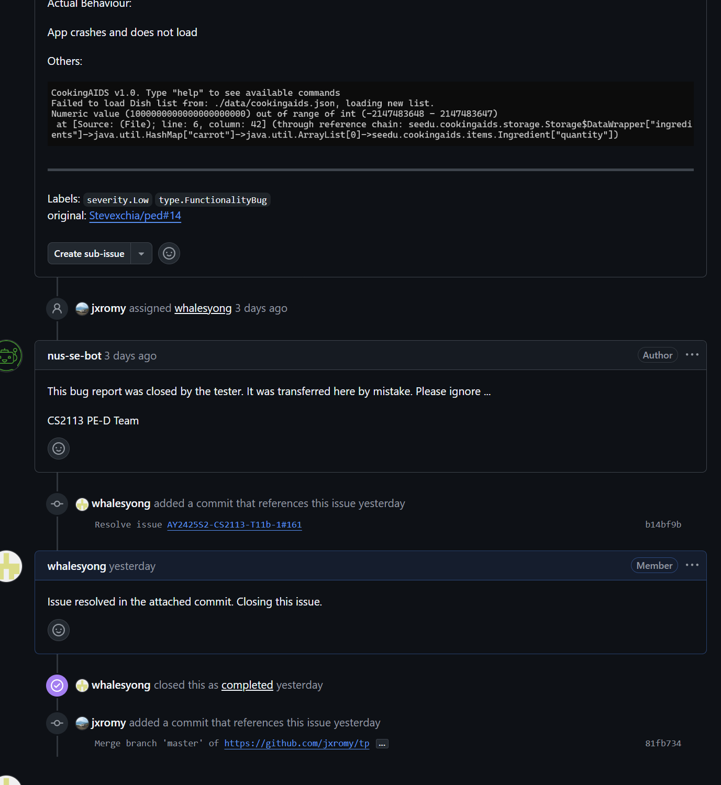
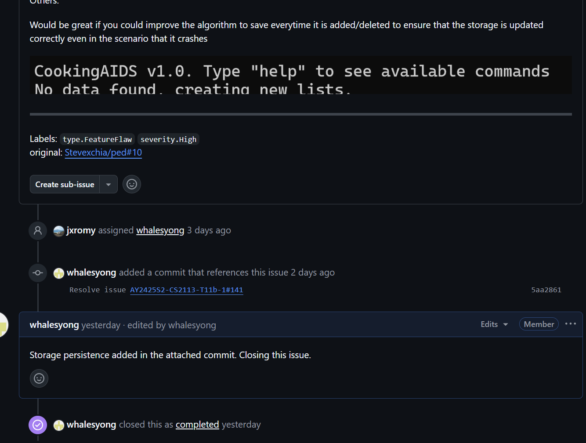
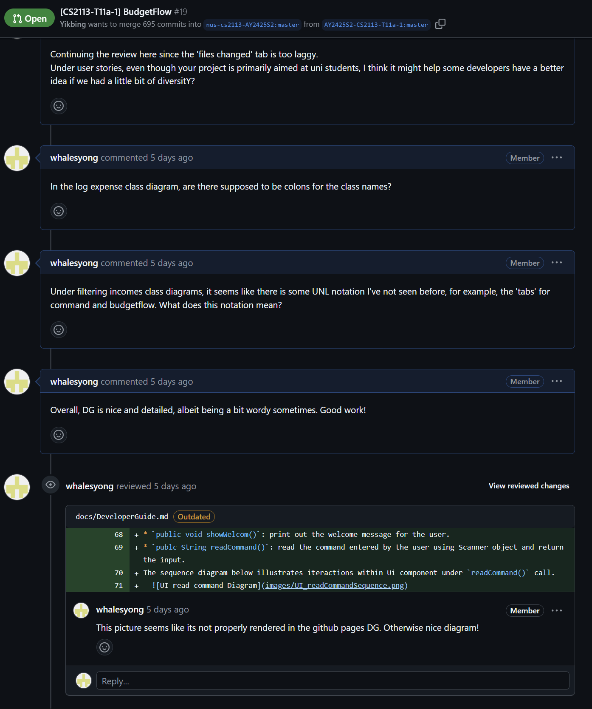

# Wei Yong's Project Portfolio Page 

# Project: CookingAids 

Cooking AIDS is a Command Line Interface (CLI) application that simplifies meal planning by allowing users to store, 
view, and organize their meals efficiently. It enables users to quickly retrieve recipes, add new ones, and plan 
meals across a calendar year, through intuitive commands in a terminal environment.

Code contributed: [RepoSense link](https://nus-cs2113-ay2425s2.github.io/tp-dashboard/?search=whalesyong&breakdown=true&sort=groupTitle%20dsc&sortWithin=title&since=2025-02-21&timeframe=commit&mergegroup=&groupSelect=groupByRepos&checkedFileTypes=docs~functional-code~test-code~other)

Given below are my contributions to the project. 

### Features Implemented 
1. **Storage implementation for loading and saving needed items to a JSON file.**

   - What it does: saves all needed items (ingredients, dishes, recipes, etc) to a `.json` file using the Jackson 
   library, and loads them when the application is launched.
   - Justification: This feature is critical to any application that manages user data. 
   - Highlights: This enhancement serves as  one of the bases of the project, and required analysis of all critical 
   classes to implement effectively. 
   The implementation was challenging since it required me to (1) tweak the class definitions of many key classes in 
   this project in a way that could be understood by Jackson, (2) write a `DataWrapper` data structure
   implementation to efficiently serialize all objects into a wrapper class, and (3) ensure that data storage is 
   persisted in case of any unexpected shutdown. 
   - Credits: Used the Jackson JSON serializer. 
2. **Suggest command implementation for suggesting recipes for the user, based on the available ingredients.**
   
   - What it does: upon the user sending the command `suggest`, suggests some potential recipes based on ingredients 
   that the user has. 
   - Justification:  We wanted users to be able to quickly decide what they might be able to meal prep, without going
   through the hassle of looking through all the ingredients by themselves. 
   - Highlights: This enhancement was one of the core features suggested for the project, as it was one of the features
   we felt would give a good user experience. In implementing this feature, I was required to come up with a 
   suggestion algorithm.
3. **Logger implementation for logging useful information to a log file, as well as showing warnings to the user.** 
   
   - What it does: Logs all occurrences to a log file stored in the data directory. This allows for better debugging
   and front-facing error declaration. 
   - Justification: We wanted to use a logger to make debugging easier for both ourselves and future developers
   who might work on our project. 
   - Highlights: This enhancement was a smaller feature implemented after the core features were done. This 
   implementation required me to integrate logging throughout the entire project, which required me to throughly sieve 
   through the project codebase and apply logging to the parts I deemed necessary.
   - Credits: Used the `java.util.logging` library to easily log all occurrences to a `.log` file when needed. 

### Testing 
As part of unit testing for CI, I wrote comprehensive test cases for the below classes that I implemented to ensure
robustness of the features. 
1. `SuggestTest`
   
   - Wrote tests to ensure that the suggestion algorithm was robust, and that it achieved its intended 
   behaviour.
2. `StorageTest`

   - Wrote tests to ensure that the storing of data was robust to invalid data, and that objects were stored correctly 
   by the Jackson ObjectMapper.
3. `LoggerTest`

   - Wrote tests to ensure the functionality of the logger, where it outputs only WARNING and above, and that a `.log`
   file is created at runtime. 

### Documentation 
1. User Guide: 
   
   - Wrote the underlying structure for the User Guide. 
   - Wrote clear documentation for the `suggest` function.

2. Developer Guide. Authored the following segments:
   
   - Storage: Wrote clear documentation for the storage section, and drew class and sequence diagrams for the implementation of the storage class. 
   - Suggest: Wrote clear documentation for the suggest section, and drew sequence diagrams for the implementation of the suggest class. 
   - Manual and Automation Testing. Wrote detailed manual test cases for the testing section, as well as instructions 
   on how to set up automation testing in IntelliJ IDEA.

### Contributions to team-based tasks
- Conducted occasional "smoke-testing" to find bugs and ensure smooth running of the application. 
- Participated and facilitated weekly team meetings. 
- Helped review and close issues, and tag the appropriate commits and PRs, as shown below:

 
and some others. 

### Contributions outside of the Team Project
 
Contributed constructive feedback to other team's repositories in the form of PR reviews.

